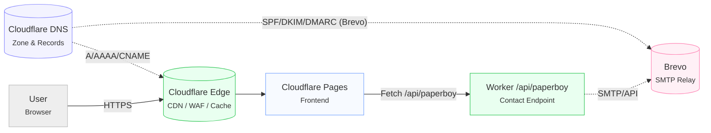
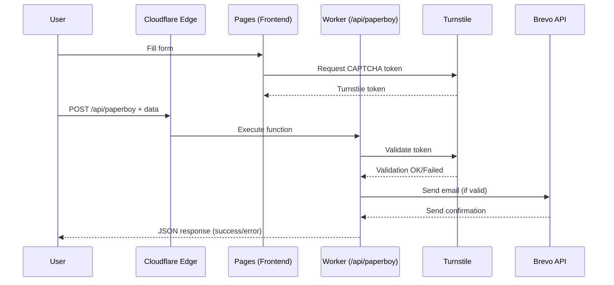

# Infrastructure Architecture

*Last updated: October 15, 2025*

## Overview

**rebond.eco** uses a full-stack Cloudflare architecture for optimal performance and enhanced security.



## Cloudflare Services

### DNS Management
- **DNS Zone**: Complete DNS record management for `rebond.eco`
- **Email Records**: SPF/DKIM/DMARC configuration for Brevo authentication
- **Security**: Native DDoS protection and Web Application Firewall (WAF)

### Cloudflare Pages
- **Static Hosting**: Files generated by Vite SSG (`dist/`)
- **Automatic Deployment**: GitHub integration with build on push
- **Global CDN**: Worldwide distribution with intelligent caching
- **Configuration**: Defined in `wrangler.toml`

### Cloudflare Functions
- **Runtime**: V8 Workers for serverless endpoints
- **Main Endpoint**: `/api/paperboy` for contact form processing
- **Security**: Integrated Turnstile validation
- **Performance**: Edge computing execution

## Detailed Data Flows

### 1. User Navigation
```
User → Cloudflare Edge → Cache/CDN → Pages (Vue.js SSG)
```
- Intelligent caching of static assets
- Automatic Brotli/Gzip compression
- Resource minification

### 2. Contact Form Processing


### 3. Build and Deployment
```
GitHub Push → Cloudflare Pages → Build (yarn build-ssg) → Deploy → CDN Refresh
```

## Configuration & Variables

### Public Variables (`wrangler.toml`)
```toml
[vars]
VITE_TURNSTILE_SITE_KEY = "0x4AAAAAAB6ZpXuSNzkjmZMQ"
```

### Secrets (managed via Wrangler CLI)
```bash
# Secret keys configuration
wrangler secret put BREVO_API_KEY
wrangler secret put TURNSTILE_SECRET_KEY
```

### Build Environment Variables
- `BASE_PATH`: Base path for assets (default: `/`)
- `VITE_*`: Variables exposed to frontend via Vite

## External Services

### Brevo (formerly SendinBlue)
- **Usage**: SMTP service for email delivery
- **API**: REST API v3 (`https://api.brevo.com/v3/smtp/email`)
- **Authentication**: API Key stored in Cloudflare secrets
- **DNS Configuration**: SPF, DKIM, DMARC records for deliverability

### Turnstile (Cloudflare CAPTCHA)
- **Usage**: Anti-bot protection for forms
- **Integration**: Frontend widget + backend validation
- **Advantage**: GDPR-friendly alternative to reCAPTCHA
- **Performance**: Native Cloudflare validation with no external latency

## Security

### DDoS Protection
- Automatic mitigation via Cloudflare Edge
- Configurable rate limiting per endpoint
- Geo-blocking available if needed

### Form Validation
- **Frontend**: Client-side TypeScript validation
- **Backend**: Re-validation + sanitization in Worker
- **Anti-spam**: Mandatory Turnstile CAPTCHA
- **CORS**: Headers configured for authorized domains

### Secrets Management
- Secrets stored in Cloudflare (encrypted)
- Rotation possible via Wrangler CLI
- No keys exposed in source code

## Monitoring & Logs

### Cloudflare Analytics
- Traffic and performance metrics
- Request and error logs
- Automatic uptime monitoring

### Debugging
```bash
# Real-time Worker logs
wrangler tail

# Local Functions testing
wrangler dev --local
```
